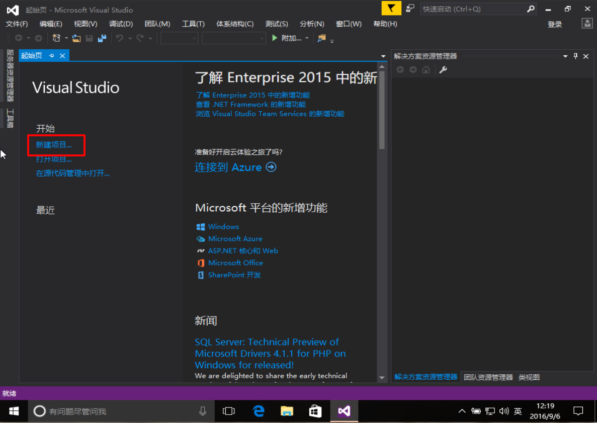
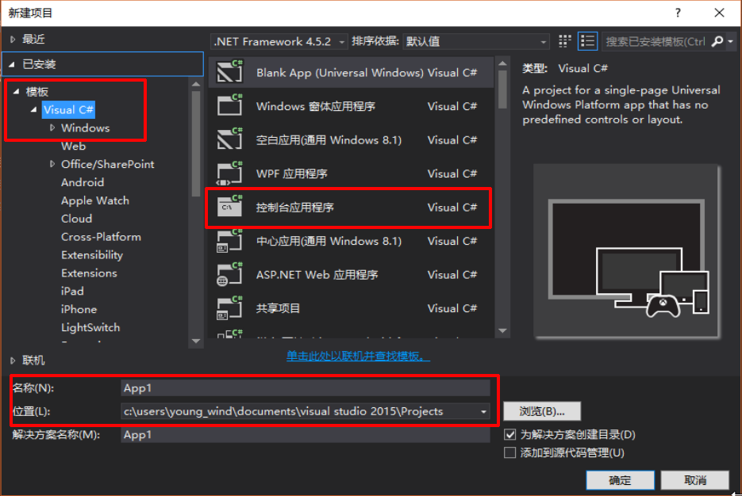

# **第一章  .NET与开发工具介绍**

## **.NET的由来**？
<font color = Brown>这是一个商业故事，事情还得从80年代说起...当时个人电脑PC兴起，微软（[Microsoft], [DOS系统]）与因特尔（[Intel], 芯片制造商）组成的Wintel联盟所向披靡，它们踩在蓝色巨人[IBM]（PC机,大型机制造商,Fortran）的肩上发达起来......关于更早计算机应用的故事，请看电影[《隐藏人物》]。整个80到90年代，微软Windows操作系统一度控制着整个PC市场，获得巨大成功......
 <br><font color = black size =4> **Windows 1.0** (1983) </font> <br> 
 <br><font color = black size =4> **Windows 2.0** (1987) </font> <br> 
 <br><font color = black size =4> **Windows 3.0** (1992) </font> <br> 
 <br><font color = black size =4> **Windows NT** (1993)  </font> <br> 
<br>
&emsp;&emsp;微软的发展，被另外一家以生产浏览器软件而闻名的网景公司(Netscape)抢占了先机，它先于微软推出浏览器软件...当时，[SUN]公司以生产UNIX服务器为主，这种服务器可以用于网站建设，所以它始终坚持"网络就是电脑"
(The Network Is the Computer)的信条。当时，SUN公司也尝试设计一种名为Java的程序语言，一开始准备将其用在家用电器市场，因为Java代码灵活小巧，可移植性强，并能够跨平台操作(只需要装一个JAVA虚拟环境JVM，不同平台安装不同版本的JVM，Java只负责将.java翻译成.class,jvm将.class翻译成机器码，这样JAVA程序就能够被各种机器识别)，不局限于某种操作系统。
 <br><br><font color = black size =4> **Java**</font> <br> <br>
1995年，互联网大行其道，SUN立刻意识到这是一个机会。因为Java适合用于编写浏览器软件。由于SUN当时对开发软件产品尚缺乏信心，所以它免费将Java放在网上，任由人们使用，没有想到此举使Java获得极大的成功和好评。微软为了打败网景，跟SUN达成某项交易，SUN允许微软使用Java语言来开发IE浏览器（就是我们当前用的IE浏览器），当IE成功问世时，微软将IE捆绑进操作系统中，使得很多电脑用户不得不使用IE作为缺省的浏览器软件。网景受到强烈的冲激，1996年春，王景拥有87%的市场占有率，1998年就降到40%，最后它也不得不免费供用户使用，终于在1998年11月，网景被美国在线(AOL)收购。<br><br>
&emsp;&emsp;**那么原本是亲密战友的SUN与微软是如何翻脸无情？以至Java最后也被Windows无情地抛弃呢？**

&emsp;&emsp;话说网景被收购后，它的一个项目Mozilla被发扬光大，发展成了今天的Firefox, Chrome等优秀的浏览器。。。这是后话。微软打败了网景后，并没有对SUN公司放松警惕，1996年9月的某个星期日，微软资深的软件工程师提笔给比尔·盖茨写了一封信，在信中,他们非常恳切地提醒比尔·盖茨注意一个正在形成的威胁，这个威胁不是来自别人，正是其盟友SUN公司创建Java，这种语言允许“**一次编写，到处运行**”（如从IBM的大型机到Sun公司的Unix服务器，再到WindowsPC机都能运行，甚至在手机平台上也可以，而不需要针对每个计算机硬件和操作系统配置的不同而改动程序代码），并且这种语言在网络上是安全的，并且支持面向对象OO程序设计。。。在信中，他写到："如果Java仅只是一种语言，对微软是不会造成威胁的。但是事实上，Java绝不仅仅是一种语言，它是COM的替代者。"--而COM恰恰是Windows基于的编程模型。"<br>
&emsp;&emsp;盖茨第二天就回信了："**这可把我吓坏了。我不清楚微软的操作系统要为Java的程序员提供什么样的东西，而这些东西将足够让它来取代我们的市场地位。这是应该最优先考虑的事情**。"(没想到，这封信成为几年后司法部针对微软的反托拉斯案的呈堂证供。)于是，Java成了Windows中不受欢迎的客人，微软开始对其进行清扫，SUN又岂是好惹的？一场针尖对麦芒的好戏就开场了...一直持续到现在...<br>
&emsp;&emsp;**首先出场的，便是微软于2000年6月推出的.NET计划...**
</font>

## Microsoft. NET 战略
- 由于Java的“**一次编程，到处使用**”特点，微软针对性的提出了.NET战略。
- .NET战略基于[NGWS](Next Generation Windows Services)下一代视窗服务。
- Microsoft预计, **.NET计划能将各种编程语言的程序员都统一到一个开发架构中来，使得他们的作品能运行在任何操作系统，任何浏览器上，并实现跨平台、跨语言开发。**
- Microsoft基于以上理念打造.NET：
    - .NET 是一个基于因特网和 WEB 的全新架构
    - .NET 是用于通用服务（Universal Services）的一种构架
    - .NET 可运行于任何平台上的任何浏览器中
    - .NET 基于最新的 web 标准
    - .NET 计划包含
        - Windows 操作系统
        - 一个新版本的 Office 
        - **一个为开发人员准备的统一开发架构 - [.NET Framework]**
    - 因此，.NET计划也可以理解为：微软公司为了维持其操作系统在市场中的垄断地位而采取的一个新措施。

## .NET遵循的因特网协议
- HTTP，因特网应用程序之间的通信协议
- XML，用于在因特网应用程序之间交换数据的格式
- SOAP，用于请求 Web Service 的标准格式
- UDDI，用于搜索和发现 Web Service 的标准

## .NET Framework
- <font color = black size =4> **.NET Framework体系** </font> <br> 
- .NET Framework是一个基于Web应用程序的基础架构，用于构建、开发以及运行Web Service和Web应用程序的**公共环境**。(类似于JDK=JVM+JRE)
- 包含一套明确的技术规范和**一系列支持产品**,如下
    1. **类库**（FCL, Framework Class Library）
        - **[ASP.NET]**支持所有.NET类库，用来承载基于.NET创建的Web应用程序
        - Web Service: 处理XML
        - Web Form: 基于HTML的应用程序
        - Windows Form: 丰富的Windows GUI应用
        - Windows Console Application: 命令行程序
        - Windows Service: Windows服务应用程序
        - 组件库: 构建单独的程序集(组件)
    2.  **公共语言运行时**(Common Language Runtime, CLR), 负责应用程序实际的执行，满足所有的应用程序的需求，
        - 那么，CRL是如何实现语言无关性的呢？
        - 由于它内置了一个中间语言库(.NET通用语言,MSIL)，首先将众多程序语言翻译成中间语言，然后通过CLR编译成及其语言：
        <br><br><font color = black size =4> **How CRL works** </font> <br>

## .NET Framework发展历程
- .NET Framework由最先开始的2.0版（类库中只包含ASP.NET,ADO.NET与WinForms）逐渐发展成到融合众多扩展包在内的4.5版本
<br><br><font color = black size =4> **.NET Framework发展历程** </font> <br>
- 直到今天的开源时代，Microsoft在2014年11月12日开放了.NET Framework的源码，并推出了[.NET Core]。
- .NET Core是一个模块化的开发栈，是参考.NET Framework重新开发的.NET实现，它是未来的所有.NET平台的基础。
- 同时，.NET Core将.NET 扩展为可在 Linux 和 Mac OS 平台上运行。
- .NET Core将基于MIT开源许可协议发布，其中将包括执行.NET代码所需的一切项目----CLR、JIT编译器、垃圾收集器（GC）和核心.NET基础类库。
- 同时，微软还发布了Visual Studio 2013.NET（开源），使得VS在Linux和OS X系统上也能够运行了
- 这样，开发者们将能够在全球三个最大的操作系统上使用.NET Framework了...
<br><br><font color = black size =4> **.NET Core与. NET Framework的关系** </font> <br>
- **因此.NET Core可看成是.NET Framework实现真正跨平台开发的版本**。基于它，微软推出了.ASP.NET Core, Xamarin等等，组成了Core生态。。。
<br><br><font color = black size =4>  </font> <br><br><br>


##.NET可以用来做什么
- .NET可以做几乎任何事情
<br><br>

## .NET Framework, .NET Core 与各版本Visual Studio之间的关系
|Visual Studio版本  | .NET Framework版本 |适用OS       |C#版本| ASP.NET版本 | 新增功能 | 
|:-----------------:| :---------------: |:----------: |:----:| :--------: |:--------:|  
|Visual Studio 6.0  |无                 |windows NT   |无    | 无          |  MVC    |  
|Visual Studio 2002 |.NET Framework 1.0 |Windows NT   |C#1.0 | 无          | .NET1.0        |       
|Visual Studio 2003 |.NET Framework 1.1 |Windows XP   |C#1.2 | 无          | .NET1.1        |    
|Visual Studio 2005 |.NET Framework 2.0 |Windows XP   |C#2.0 | 无          | 泛型     |  
|Visual Studio 2008 |.NET Framework3.5  |Windows Vista|C#3.0 |ASP.NET 3.5  | WPF,WCF,LINQ |  
|Visual Studio 2010 |.NET Framework4.0  |Windows 7    |C#4.0 |ASP.NET 4    | DLR,Silverligtht        |  
|Visual Studio 2012 |.NET Framework4.5  |Windows 8    |C#5.0 |ASP.NET 4.5  |支持win8       |    
|Visual Studio 2013 |.NET Framework4.6  |Windows 8    |C#6.0 |ASP.NET 4.5.1|支持app开发         |   
|Visual Studio 2015 |.NET Fram+Core1.0  |Windows 10   |C#6.0 |ASP.NET 1.0  |Azure       |    
|Visual Studio 2017 |.NET Core2.0       |Windows 10   |C#6.0 |ASP.NET 1.0  |Core        |    

## C#
- 由上可知，.NET 框架支持多种语言，C#,VB,J#,C/C++
- 与Java比较像(本来嘛，就是竞争产品)
- C#是一种安全的、稳定的、简单的、优雅的，由C和C++衍生出来的面向对象的编程语言。它在继承C和C++强大功能的同时去掉了一些它们的复杂特性（例如没有宏和模版，不允许多重继承）。C#综合了VB简单的可视化操作和C++的高运行效率，以其强大的操作能力、优雅的语法风格、创新的语言特性和便捷的面向组件编程的支持成为.NET开发的首选语言。
- C#的特点：
    1. **完全面向对象**。
    2. **支持分布式**。之所以有C#，是因为微软相信分布式应用程序是未来的趋势，即处理过程分布在客户机和服务器上。所以C#一出生就注定了能很好解决分布式问题。
    3. 跟Java类似，C#代码经过编译后，成为了一种IL（中间语言）。在运行时，再把IL编译为平台专用的代码。
    4. **健壮性**，C#在检查程序错误和编译与运行时错误一点也不逊于Java，C#也用了自动管理内存机制。
    5. C#不像Java那样完全摒弃了指针和手动内存管理。C#默认情况下是不能使用指针的，程序员在有必要时可以打开指针来使用。这样可以保证编程的灵活性。
    6. **安全性**：C#的安全性是有.net平台来提供的。C#代码编译后成为IL语言。是一种受控代码，.net提供类型安全检查等机制保证代码是安全的。
    7. **可移植性**：由于C#使用类似Java的中间语言机制。使得C#也跟Java类似，可以很方便的移植到其他系统。在运行时，再把中间代码编译为适合特定机器的代码。
    8. **解释性**：C#也是一种特殊的解释性语言。
    9. **高性能**：C#把代码编译成中间语言后，可以高效的执行程序。
    10. **多线程**：与Java类似，可以由一个主进程分出多个执行小任务的多线程。
    11. **组件模式**：C#很适合组件开发。各个组件可以由其他语言实现的，然后集成在.net中。
- C#是在Java流行起来后所诞生的一种新的语言。由于微软在操作系统上占有很大的优势。在以往的开发中累积了不少经验，所形成的.net平台，所以C#在Windows方面可以说比Java具有更大的优势。如果单纯从技术上来讲，C#在网络编程上可以与Java匹敌。C#还在Windows Forms也有一定的优势。
- C#是一种非常类似于C++的语言，风格是更接近于Java，不管是C++程序员还是Java程序员，都可以很方便的转到C#上来。
- C#的强大是依赖于.net的发展，而.net的发展是看微软在.net上的决心和投入有多少。
- C#目前主要是应用在网络编程上，其他领域比如数据库、窗体编程，都逐渐在增大。
- 在Visual Studio中创建C#程序（实际上是创建解决方案->在其中创建工程->在其中创建c#程序）
1. 首先双击visual studio的图标，打开初始界面。注意，如果你的是第一次打开，可能初始化的时间有点长，请耐心等待。启动后会出现类似于下图所示界面：
<br><br>
2. 然后在起始页点击新建项目（或者点击"文件"->新建->项目），出现下图的界面：
<br><br>
3. 在左侧选择visual C#，在中间选择控制台应用程序，下方可以更改程序名称和程序的存储位置，然后点击右下方的确定按钮，就出现下图了：
<br><br>
### 一段典型的C#代码
```C#
using System;        //using是关键字，引用一个System的名称空间
using System.Collections.Generic;  //同上
using System.Linq;    //同上
using System.Text;    //同上

namespace Mynamespace   //声明自己的名称空间，命名空间提供了一种从逻辑上组织类的方式，防止命名冲突。 
{
    class Myclass     //定义类型，隐私性默认值为protected，即对自己及派生类开放成员
    {
        static void Main(string[] args)    //定义一个类下的成员：Main方法 
                                           //static表示该成员是静态的，即程序一开始就分配了内存，使用的时候不需要生成某个类型的对象
                                           //void表示该成员没有返回值
                                           //Main表示该方法是主方法，程序的'入口'
                                           //string[] args表示命令行参数是字符串数组，即，你在命令行（黑框框）里输入的参数可以使多个字符串
                                           //args是用来处理命令行参数的，即，运行这个程序的时候给它传的参数。是可选项，不是必须的。
        {
            System.Console.WriteLine("请输入num的值，回车结束");
            int num = Console.Read();             //定义并获取变量(值类型)
            String str = "not123";                //定义字符串类型变量（引用类型）
     
            if (num == 123)               //判断num是否有值           
            { Console.WriteLine("num = " + num);}   //如果有值就输出num
            else
            { Console.WriteLine(str); }    //如果没有值就输出提示

            Console.ReadKey();       //防止闪退
        }
    }

}
```
### 再看一个典型算法例子
```
using System;

namespace Yournamespace
{
    class Yourclass
    {
        static void Main()
        {
            int a = 1;
            while (a == 1)
            {
                Console.Write("请输入待排序列个数n（输入完成后以换行符结束）：");
                int n = Convert.ToInt32(Console.ReadLine());
                Console.WriteLine("请分别输入待排序元素（每个元素以换行符隔开）：");
                int[] Sqlist = new int[n];
                for (int i = 0; i < Sqlist.Length; i++)
                {
                    Sqlist[i] = Convert.ToInt32(Console.ReadLine());
                }
                Console.Write("请选择排序方法（1.直接插入排序 2.冒泡排序）：");
                int number = Convert.ToInt32(Console.ReadLine());
                Console.WriteLine();
                if (number == 1) zhijiecharu(Sqlist);
                if (number == 2) maopao(Sqlist);
                Console.WriteLine("该序列从小到大为：");
                Console.WriteLine();
                for (int i = 0; i < Sqlist.Length; i++)
                {
                    Console.Write(Sqlist[i] + " ");
                }
                Console.WriteLine();
                Console.WriteLine("******此次排序完成******");
                Console.WriteLine();
                Console.Write("是否继续排序（1.继续排序 0.退出排序）：");
                a = Convert.ToInt32(Console.ReadLine());
                Console.WriteLine();
            }
            Console.WriteLine("排序结束！");
            Console.ReadKey();

        }
        //直接插入排序
        static void zhijiecharu(int[] Sqlist)
        {
            Console.WriteLine("******直接插入算法******");
            Console.WriteLine();
            for (int i = 1; i < Sqlist.Length; i++)
            {
                int t = Sqlist[i];
                for (int j = i - 1; j >= 0; j--)
                {
                    if (t < Sqlist[j])
                    {
                        Sqlist[j + 1] = Sqlist[j];
                        Sqlist[j] = t;
                    }
                }
                Console.WriteLine("***第{0}次排序***", i);
                for (int n = 0; n < Sqlist.Length; n++)
                {
                    Console.Write(Sqlist[n] + " ");
                }
                Console.WriteLine();
                Console.WriteLine();
            }
            Console.WriteLine();
        }
        //冒泡排序
        static void maopao(int[] Sqlist)
        {
            Console.WriteLine("******冒泡排序******");
            Console.WriteLine();
            for (int i = 1; i < Sqlist.Length; i++)
            {
                int m;
                for (int j = 0; j < Sqlist.Length - i; j++)
                {
                    if (Sqlist[j] > Sqlist[j + 1])
                    {
                        m = Sqlist[j + 1];
                        Sqlist[j + 1] = Sqlist[j];
                        Sqlist[j] = m;
                    }
                }
                Console.WriteLine("***第{0}次排序***", i);
                for (int n = 0; n < Sqlist.Length; n++)
                {
                    Console.Write(Sqlist[n] + " ");
                }
                Console.WriteLine();
                Console.WriteLine();
            }
            Console.WriteLine();
        }
    }


}


```

## ASP.NET Core
- [ASP.NET Core 介绍和项目解读](http://www.cnblogs.com/liangxiaofeng/p/5795239.html)

### IDEs

- **Visual Studio 2017** [download](https://www.visualstudio.com/zh-hans/)
    - **Community版(推荐)**
    - Professional版
    - Enterprise版
- **Visual Studio Code** [download](https://code.visualstudio.com/)
    - **轻量级编辑器，微软良心产品，推荐结合.NET Core使用**:purple_heart:
    - [VS Code 使用手册](https://code.visualstudio.com/docs)
    - [如何使用VSCode运行第一个C#程序](https://channel9.msdn.com/Blogs/dotnet/Get-started-with-VS-Code-using-CSharp-and-NET-Core)
    - [VS Code on Git](https://github.com/OmniSharp/omnisharp-vscode/blob/master/debugger.md)


## 查阅最新.NET Framework官方文档
- [中文总参考](https://docs.microsoft.com/zh-cn/dotnet/)
- [英文总参考](https://docs.microsoft.com/en-us/dotnet/)
- [中文.NETFramework文档](https://docs.microsoft.com/zh-cn/dotnet/framework/)
- [英文.NETFramework文档](https://docs.microsoft.com/en-us/dotnet/framework/)


## 用VS Code + .NET Core运行第一个C#程序

<!-- 下面是本文档中用到的链接 --->
[《隐藏人物》]: https://baike.baidu.com/item/%E9%9A%90%E8%97%8F%E4%BA%BA%E7%89%A9/2454257?fr=aladdin
[DOS系统]:http://www.pc811.com/xitong/26367.html
[Microsoft]:https://www.microsoft.com/
[Intel]:https://www.intel.com/
[IBM]:https://www.ibm.com/
[微软与Netscape之间的恩怨]: https://en.wikipedia.org/wiki/Netscape
[SUN]:https://www.oracle.com/sun/index.html
[NGWS]:https://docs.microsoft.com/en-us/dotnet/framework/
[.NET Framework]:https://docs.microsoft.com/en-us/dotnet/framework/
[中文.NETFramework链接]:https://docs.microsoft.com/zh-cn/dotnet/framework/
[英文.NETFramework链接]:https://docs.microsoft.com/en-us/dotnet/framework/
[ASP.NET]:https://docs.microsoft.com/zh-cn/aspnet/core/
[Visual Studio]:https://www.visualstudio.com/zh-hans/
[Visual Studio Code]:https://www.visualstudio.com/zh-hans/
[.NET Core]: https://docs.microsoft.com/zh-cn/dotnet/core/
[.NET Core document]:https://docs.microsoft.com/zh-cn/dotnet/core/
[所有产品目录]: https://docs.microsoft.com/zh-cn/dotnet/
[VS Code on Git]:https://github.com/Microsoft/vscode/
[Core时将基于MIT开源许可协议发布]:https://github.com/dotnet/coreclr
[VS Code 使用手册]:https://code.visualstudio.com/docs

