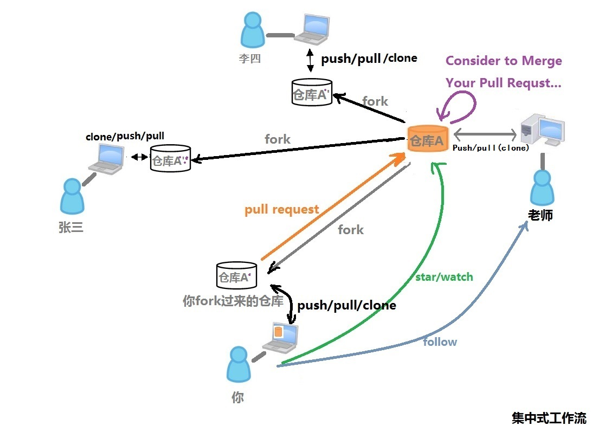
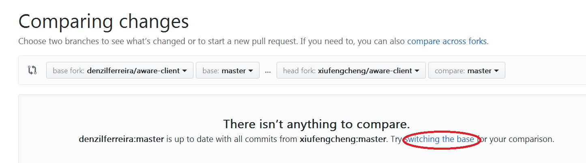

# **第二章  Github与工作流**
# 如何使用Github与他人协作
## Step 1. 注册Github账号  
* 建议各位使用QQ邮箱进行注册  
* 注册号以后登录，会发现一个带有火箭的页面，它表   示着你的GitHub之旅即将启程  

## Step 2. Follow别人
* 就是用Git上方的搜索栏找人...找到他的主页，然后follow他，这样你的following里面就会有那个人。
* 老师的主页在这里[github.com/xiufengcheng](github.com/xiufengcheng)

## Setp 3. 在网页上新建一个仓库(Repository)  
* 点击右上角的加号添加一个仓库（Repository）    
   

* 新建一个仓库    
   

* 你会发现你多了一个仓库  
  

* 以后登录网站，进入自己的主页面，需要点击右上角的图像，选择Your Profile 就可以看到自己建的所有仓库了。  
  

## Step 4.将你的组员加为协作者
* 只要你在你自己的仓库中点击Settings->Collaborators->加入你的组员，你的组员就可以下载，更新，上传项目了。
  
  
* 注意，如果你在你的某个仓库中加了某人为自己的协作者(Collaborators)，那么他/她就有权利将自己的改动通过Push上传到你的仓库了哦~~也就是说，Collaborator是可以免审核直接修改你的代码的。
* 这样的协作方式叫**协作者模式**，最简单的协作方式。但是有明显的缺点，那就是没有审核机制，任何人都可以在对一个仓库进行更改（跟新建一个文件夹，所有人在里面增删改查一回事），人一多(>5人)，就会有很多冲突问题。
* 不过人少的时候这个方式很受用。

## Step 5. Fork别人的仓库
* 首先登陆你的账号
* 找到一个人的主页，然后找到他的仓库
* 老师的仓库在这里[https://github.com/xiufengcheng/DATASTRUCTURE](https://github.com/xiufengcheng/DATASTRUCTURE)
* 点击右上角的Fork

* 然后等待...等fork成功后，会自动跳转到你fork过来的你自己的远程仓库页面。
* **注意**，**fork模式**，又称为**集中式工作流**，是Step 4.的**协作者模式**的升级版，顾名思义就是有了“小组长审核”这一步。因此，如果你们组只需要**协作者模式**进行开发，多人升级一个仓库，那么请无视这一步。下图很好的解释了fork模式的工作原理。（把'老师'改为'组长'）。
 
* 图中，你首先找到老师(组长)的仓库A,然后fork仓库A,这样你的远程就有了一个仓库的映像A‘(A’是不会自动随着A的更新而更新的哦~)，然后你或其他组员不停的改动自己的仓库A'，等到改好后，Commit->Push/Pull->Pull Request. Commit是本地更改，Push/Pull是本地推到A',Pull是A'拉到本地，而Pull Reqeust是A'申请和A合体，明白？对，pull reqeust就是**求合体**。

## Step 6. 使用Git Desktop工具
 GitHub有两种工具，一种是**git**本身，这个用百度搜索git第一个就是，点击下载，下载后右键菜单里就会出现**Git bash here**菜单，它是命令行工具，可以用它来做更加细致的工作。 

 另一种是相对简单的图形界面操作工具**GitHub Desktop**，这两种工具的作用都是一样的，只是操作方法后者更为简单易用。在这里我们只介绍GitHub Desktop。

### [在这里下载GitDesktop](https://desktop.github.com/)

* 安装完成后，你会看到桌面上的快捷方式  
  

* 第一次打开它时，输入你的GitHub的账号和密码  
  

## Step 7. 克隆/下载仓库 (Clone or Download)
* 你当然可以直接从网页上下载源代码。做法是：找到你fork过来的仓库(也可以是别人的任何仓库)，点击右边绿色的Clone or download
 
* 但是建议使用Gitdesktop进行下载，这样很多事情后来会比较便利。选择File->Clone Repository，将别人或你的远程仓库克隆到你的电脑上。
* **注意**，如果你克隆的是**你的远程仓库**(你新建的或者你fork的仓库)，那么你将可以通过Pull/Push对**你的远程仓库**进行更改。
* 但是，如果你克隆的是别人的仓库，你后来是没有权限Push到别人仓库上的，除非别人加你为Collaborator。
* 所以，如果你们组打算用**Fork模式**进行协作，那么你首先需要Fork**组长的仓库**，然后克隆**你Fork过来的仓库**到**你的本地**，改改然后向组长发起pull reqeust。
  
* 点击Clone开始克隆，克隆完成后，你的本地就有一个下载下来的仓库，并且这个仓库和远程仓库保持同步。
* Clone是第一次的Pull/Fetch，一旦Clone，以后就不需要Clone了 

## Step 8. 更新本地仓库
* 你可以在你的本地电脑上更改克隆过来的东西(增删改等操作)，这个谁都会哈。

## Step 9. 将本地更新推送(Push)到你的远程仓库
* 更改好后，你可以将本地版本Push到**你的远程仓库**（无论是你自建的还是Fork别人的仓库）上
* 如何Push呢？
* 很简单，本地代码有任何的变动，GitHub Desktop是会捕捉到的。 

* 其中红色带减号的部分表示删除的内容，绿色加号部分表示增加的内容 
* 在左下角的summary中填上你更改的说明情况，然后点击左下角的Commit按钮  

* 然后再点击右上角的Push按钮  
  
* 这里在说一遍：**Commit是提交到本地更新（还没有上传到远程），Push则是从本地刷远程。**

## Step 10. 将本地更新推送(Push)到别人的远程仓库
* 其实，你可以Push的远程仓库有两类，一类是**你的远程仓库**(无论是自己建的还是Fork别人的仓库)，一类是别人的仓库(前提是这些仓库加了你为Collaborator) 。

## Step 11. 将远程仓库同步到本地（Fetch/Pull）
* 这里的Fetch也就是Pull, 点击Fetch按钮(和Push按钮的位置一样)，就可以刷新本地仓库了！

## Step 12. 保持你的fork仓库与别人仓库的同步更新(这一步在提交Pull Request之前很有用)
* 经常看到许多人，只会fork一次，提交过一次修改就不知怎么办了！而原作者是非常勤奋的，一天会提交N次，一个星期后许多文件都改动过了，而那些代码贡献者不可能一个个跟着修改。 因此我们还是用到上方的pull request按钮。
* 选中自己fork过来的项目，然后选择pull request

* 然后选择Switching the base,把你的fork项目作为base,把人家的作为head，总之反转过来。
* 然后Merge，这样你就更新了的fork仓库。

## Step 13. 向原创者发起Pull Request  
* Git是一个很强大的工具，其中重要的一点就是可向任何人发起Pull Request，**下图又闪亮登场！足以说明重要程度！**
 

* 首先，你必须fork别人的某个仓库，这样，你的远程仓库中拷贝了一份和别人一模一样的仓库。怎样区分是你自己的还是别人fork过来的仓库呢？看下图。找出图标的区别。  
  

* 然后，Push到自己远程工作做完后，你的**远程仓库**和**原作者的远程仓库**是两个版本了不是？
* 这时候，你就需要发起Pull Request到原作者，请求他合并(Merge)
* 具体做法：网页上进入你fork过来的远程仓库，点击New Pull Request  

* 填写该填写的东西，提交给原创作者。接下来的事就交给原创作者自己定夺了

* 期间，可能还有原作者不满意，退回修改的过程

* 有关更详细的git指南请参考
[**Git工作流**](https://github.com/xirong/my-git/blob/master/git-workflow-tutorial.md)  

