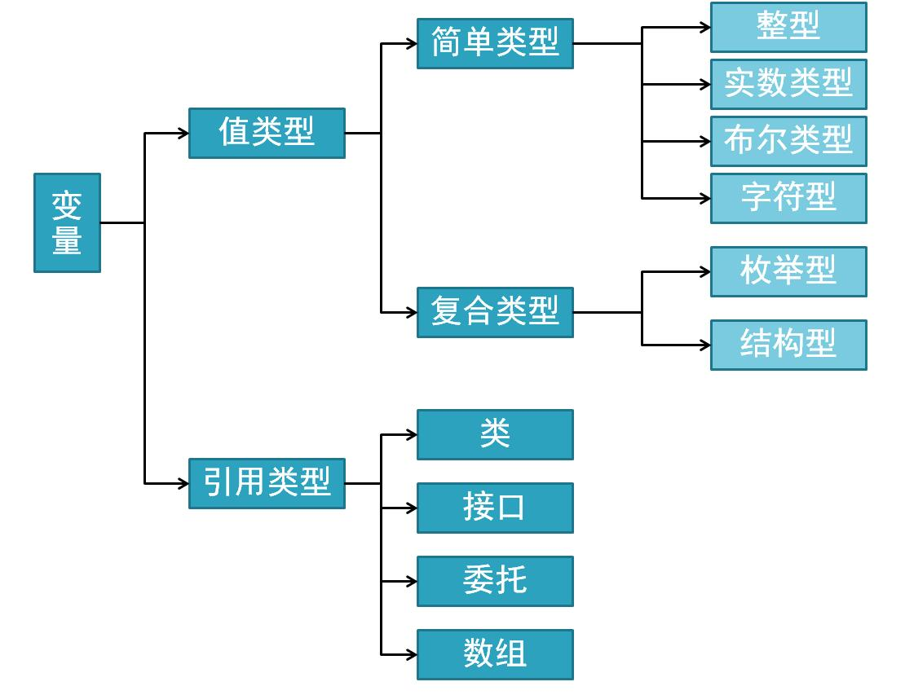
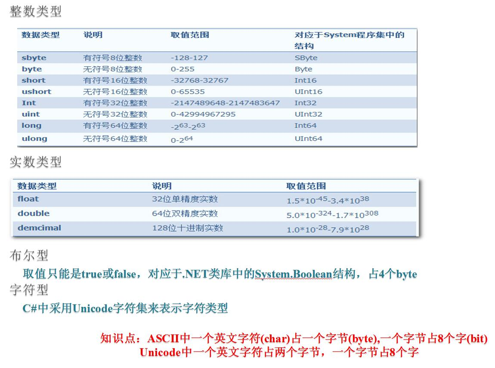

## C#数据类型概览


### 命名规则：
1. 必须以“字母” _  或 @ 符号开头.   不要以数字开头
2. 后面可以跟任意“字母”、数字、下划线.
3. 注意:
    - 你起的变量名不要与c#系统中的关键字重复.在c#中,大小写是敏感的.
    - 同一个变量名不允许重复定义(先这么认为,不严谨)
    - 定义变量时，变量名要有意义 
4. C# 变量命名编码规范：
    - Camel 命名法：首个单词的首字母小写，其余单词的首字母大写，例如accountBalance。
    - Pascal命名法:每一个单词第一字母都大写如果使用到英文单词的缩写，全部用大写. 


### 简单类型：整形、实数类型、布尔型、字符型
```c#
using System;
using System.Collections.Generic;
using System.Linq;
using System.Text;

namespace Sample2_1
{
    class Program
    {
        static void Main(string[] args)
        {
            int color = 4;
            double x = 1.2;
            bool isDrawsuccessful = true;
            char a = 's';
            char b = '圆';
            char c = '\\';
            string s = “人”;
            double r = 0,s = 0;          //定义变量半径r,面积变量s
            const double pi = 3.14;      //定义常量圆周率pi
            Console.WriteLine("请输入圆的半径:\n");
            double.TryParse(Console.ReadLine(), out r);//读取用户输入的半径
            s = pi * r * r;
            Console.WriteLine("圆的半径是：{0}",r);
            Console.WriteLine("圆的面积是：{0}",s);
            Console.ReadLine();

        }
    }
}
```
### 复合类型：结构体
```c#
using System;

namespace P3_1
{
    class Program
    {
        static void Main()
        {
            ComplexNumber c1; //定义结构变量c1
            c1.a = 1.5;
            c1.b = 3;
            ComplexNumber c2 = c1; //定义结构变量c2
            c2.a = c2.b;
            Console.Write("c1 = ");
            c1.Write();
            Console.Write("c2 = ");
            c2.Write();
            Console.ReadLine();
        }
    }
    
    struct ComplexNumber
    {
        public double a;
        public double b;

        public void Write()
        {
            Console.WriteLine("{0}+{1}i", a, b);
        }
    }
}
```

### 复合类型：枚举
```c#
Namespace ConsoleApplication
{
  class Program
  {
     enum MyDate //使用enum创建枚举
     {
         Sun=0,
         Mon=1,
         Tue=2,
         Wed=3,
         Thi=4,
         Fri=5,
         Sat=6
     }
   
    Static void Main(String[] args)
      {
          int k = (int)DateTime.Now.DayOfWeek;//获取代表星期几的返回值
          Switch(k)
          {
              case (int)MyDate.Sun:Console.WriteLine("今天是星期日"); break;
              case (int)MyDate.Mon:Console.WriteLine("今天是星期一"); break;
              case (int)MyDate.Tue:Console.WriteLine("今天是星期二"); break;
              case (int)MyDate.Wed:Console.WriteLine("今天是星期三"); break;
              case (int)MyDate.Thi:Console.WriteLine("今天是星期四"); break;
              case (int)MyDate.Fri:Console.WriteLine("今天是星期五"); break;
              case (int)MyDate.Sat:Console.WriteLine("今天是星期六"); break;
          }
              Console.ReadLine();
      }
  }
}
```
### 引用类型：类
```c#
using System;

namespace P3_2
{
    class Program
    {
        static void Main()
        {
            ComplexNumber c1 = new ComplexNumber(); //创建c1对象
            c1.a = 1.5;
            c1.b = 3;
            ComplexNumber c2 = c1; //创建c2对象
            c2.a = c2.b;
            Console.Write("c1 = ");
            c1.Write();
            Console.Write("c2 = ");
            c2.Write();
            Console.ReadLine();
        }
    }

    class ComplexNumber  //注意这里变成了类
    {
        public double a;
        public double b;

        public void Write()
        {
            Console.WriteLine("{0}+{1}i", a, b);
        }
    }
}
```

### 引用类型：数组
#### 一维数组
```c#
using System;
using System.Text;

namespace P3_3
{
    class Program
    {
        static void Main()
        {
            ComplexNumber c1 = new ComplexNumber();
            c1.a = 1.5;
            c1.b = 3;
            ComplexNumber[] cs = new ComplexNumber[4];
            cs[0] = c1;
            cs[1] = new ComplexNumber();
            cs[1].a = 4;
            cs[1].b = 5;
            cs[2] = c1;
            cs[3] = cs[1];
            cs[0].a = 8;
            cs[3].b = 9;
            Console.Write("c1 = ");
            c1.Write();
            Console.Write("cs[1] = ");
            cs[1].Write();
            Console.Write("cs[2] = ");
            cs[2].Write();
            Console.ReadLine();
        }
    }

    class ComplexNumber
    {
        public double a;
        public double b;
        public void Write()
        {
            Console.WriteLine("{0}+{1}i", a, b);
        }
    }
}
```

#### 多维数组
```c#
using System;

namespace P3_4
{
    class Program
    {
        static void Main()
        {
            int[,] x = new int[2, 3] { { 1, 2, 3 }, { 3, 5, 8 } };
            int[,] y = new int[,] { { 10, 50 }, { 25, 75 }, { 50, 150 }, { 100, 80 } };
            int[, ,] z = { { { 1, 2 }, { 3, 5 }, { 8, 13 } }, { { 1, 2 }, { 3, 5 }, { 8, 13 } } };
            Console.Write("数组x长度为: ");
            Console.WriteLine(x.Length);
            Console.WriteLine("各维长度: {0} * {1}", x.GetLength(0), x.GetLength(1));
            Console.Write("数组y长度为: ");
            Console.WriteLine(y.Length);
            Console.WriteLine("各维长度: {0} * {1}", y.GetLength(0), y.GetLength(1));
            Console.Write("数组z长度为: ");
            Console.WriteLine(z.Length);
            Console.WriteLine("各维长度: {0} * {1} * {2}", z.GetLength(0), z.GetLength(1), z.GetLength(2));
            Console.ReadLine();
        }
    }
}
```

### 引用类型： 接口(注意和抽象类的区别)
```c#
using System;
using System.Collections.Generic;
using System.Linq;
using System.Text;

namespace Sample8_1
{
    class Program
    {
        static void Main(string[] args)
        {
            Car car = new Car("小汽车");
            car.Show();
            car.Move();
            car.GetWheel();
            Plane plane = new Plane("飞机");
            plane.Show();
            plane.Move();
            plane.GetWheel();
            Console.ReadLine();
        }
    }

    //定义抽象类，表示交通工具
    abstract class Travel
    {
        protected string _name;//交通工具的名称

        public abstract string Name//定义抽象属性，表示交通工具的名称
        {
            get;
            set;
        }

        public void Show()//定义一般方法，用来显示是何种交通工具
        {
            Console.WriteLine("这是{0}",_name);
        }
        public abstract void GetWheel();//获取轮子的数量
    }

    //定义接口
    interface IAction
    {
        //注意这个方法同抽象类中的方法GetWheel的区别
        //任何东西都可以具有移动行为，而只有交通工具才有轮子
        void Move();//表示交通工具行驶的行为
    }
    class Car : Travel, IAction
    {
        public override string Name//重写抽象类属性
        {
            get
            {
                return _name;
            }
            set
            {
                _name = value;
            }
        }
        public Car(string name)
        {
            _name = name;
        }
        public void Move()//实现接口方法
        {
            Console.WriteLine("小汽车行走在公路上");
        }

        public override void GetWheel()//重写抽象类方法
        {
            Console.WriteLine("小汽车有4个轮子");
        }
    }
    class Plane : Travel, IAction
    {
        public override string Name//重写抽象类属性
        {
            get
            {
                return _name;
            }
            set
            {
                _name = value;
            }
        }
        public Plane(string name)
        {
            _name = name;
        }
        public void Move()//实现接口方法
        {
            Console.WriteLine("飞机在空中飞行");
        }

        public override void GetWheel()//重写抽象类方法
        {
            Console.WriteLine("飞机有6个轮子");
        }
    }
}
```

### 引用类型: 委托

### 类型转换：显示转换
```c#
using System;

namespace P3_5
{
    class Program
    {
        static void Main()
        {
            Weekday w1 = 0;
            Weekday w2 = (Weekday)3; // 显式转换
            Weekday w3 = (Weekday)100; // 显式转换
            Console.WriteLine(w1);
            Console.WriteLine(w2);
            Console.WriteLine(w3);
            int x = (int)Weekday.Friday; // 显式转换
            Console.WriteLine(x);
            Console.ReadLine();
        }
    }

    enum Weekday
    {
        Monday, Tuesday, Wednesday, Thursday, Friday, Saturday, Sunday
    }
}
```
### 类型转换：隐式转换
```
int a = 100;
long b = a;
```

### 类型转换：引用类型之间的转换
```c#
using System;

namespace P3_6
{
    class Program
    {
        static void Main()
        {
            Graduate g1 = new Graduate();
            g1.name = "陈亮";
            Student s1 = g1; // 隐式转换
            Student s2 = new Student();
            s2.name = "宋燕燕";
            Graduate g2 = (Graduate)s1; // 显式转换
            Console.WriteLine(g2.name);
            //Graduate g3 = (Graduate)s2; // 错误：转换失败！

            Graduate[] gs1 = new Graduate[] { g1, g2 };
            Student[] ss1 = gs1;
            Graduate[] gs2 = (Graduate[])ss1;
            Console.ReadLine();
        }
    }

    class Student
    {
        public string name;
        public int age;
        public int grade;
        public void Register() { }
    }

    class Graduate : Student
    {
        public string supervisor = null;
    }
}
```

### 操作符
```c#
using System;

namespace P3_7
{
    class Program
    {
        static void Main()
        {
            bool[] x = new bool[5];
            Console.WriteLine("请依次输入5位考官的评分，1通过，0不通过: ");
            x[0] = (Console.ReadLine() == "1");
            x[1] = (Console.ReadLine() == "1");
            x[2] = (Console.ReadLine() == "1");
            x[3] = (Console.ReadLine() == "1");
            x[4] = (Console.ReadLine() == "1");
            int i = 0;
            bool b = (x[i++]) && (x[i++] || x[i]) && (x[++i] || x[++i]);
            Console.WriteLine("考核结果为: {0}", b);
            Console.WriteLine("判断次数为: {0}", i); 
            Console.ReadLine();
        }
    }

    enum Weekday
    {
        Monday, Tuesday, Wednesday, Thursday, Friday, Saturday, Sunday
    }

}
```

### as操作符
```c#
using System;
using System.Collections.Generic;
using System.Linq;
using System.Text;

namespace Sample2_7
{
    class ClassA { }//定义类A
    class ClassB { }//定义类B


    class Program
    {
        static void Main(string[] args)
        {
            object[] objArray = new object[6];//定义数组，该数组的长度为6，包含的数据类型为object
            objArray[0] = new ClassA();//第1个元素被赋予类A的一个对象
            objArray[1] = new ClassB();//第2个元素被赋予类B的一个对象
            objArray[2] = "hello";//第3个元素被赋予字符串
            objArray[3] = 123;//第4个元素被赋予整型数据
            objArray[4] = 123.4;//第5个元素被赋予浮点数
            objArray[5] = null;//第6个元素被赋予空

            for (int i = 0; i < objArray.Length; ++i)//遍历数组objArray
            {
                string s = objArray[i] as string;//把数组元算转换为字符串
                Console.Write("{0}:", i);//输出该元算
                if (s != null)//如果转换结果不为空
                {
                    Console.WriteLine("'" + s + "'");//输出转换结果
                }
                else//否则
                {
                    Console.WriteLine("不是字符串");
                }
            }
            Console.ReadKey();

        }
    }
}
```

### is操作符
```c#
using System;
using System.Collections.Generic;
using System.Linq;
using System.Text;

namespace Sample2_8
{
    class ClassA { }//定义类A
    class ClassB { }//定义类B
    class Program
    {
        static void Test(object o)
        {
            ClassA a;//声明类A的对象a
            ClassB b;//声明类B的对象b

            if (o is ClassA)//如果o是类A
            {
                Console.WriteLine("o 是类A");
                a = (ClassA)o;//可以把o转化为类A，而不出现异常
            }
            else if (o is ClassB)//如果o是类B
            {
                Console.WriteLine("o is 类B");
                b = (ClassB)o;//可以把o转化为类B，而不出现异常
            }
            else
            {
                Console.WriteLine("o 不是类A，也不是类B.");
                Console.WriteLine("o是{0}", o.GetType());//输出o的类型
            }
        }

        static void Main(string[] args)
        {
            ClassA a1 = new ClassA();//声明类A的对象a1
            ClassB b2 = new ClassB();//声明类B的对象b1
            Test(a1);
            Test(b2);
            Test("a string");
            Console.ReadKey();

        }
    }
}
```

### 泛型
```c#
public class Stack<T> //定义一个堆栈，并使用<T>定义通用数据类型T
{
    private T[] m_item;//定义一个T型的数组
    public T Pop() {...}//出栈
    public void Push(T item){...}//入栈
    public Stack(int i) //堆栈类的构造函数
    {this.m_item = new T[i]; //初始化数组}

}
```
//以上代码定义了一个堆栈类Stack，由于使用<T>为其定义了通用类型T,表明该类可以使用于任何数据类型。例如“
```c#
Stack<int> a = new Stack<int> (100);
a.Push(10);
a.Push("8888");//这一行编译不通过，因为类a只接收int类型的数据
int x=a.Pop();
//实例化只能保存string类型的类
Stack<string> b = new Stack<string>(100);
b.Push("8888");
string y = b.Pop();
```


## 作业1
编写一个完整的汽车类程序，要求包含所有的以上数据类型、操作、运算符与方法。


