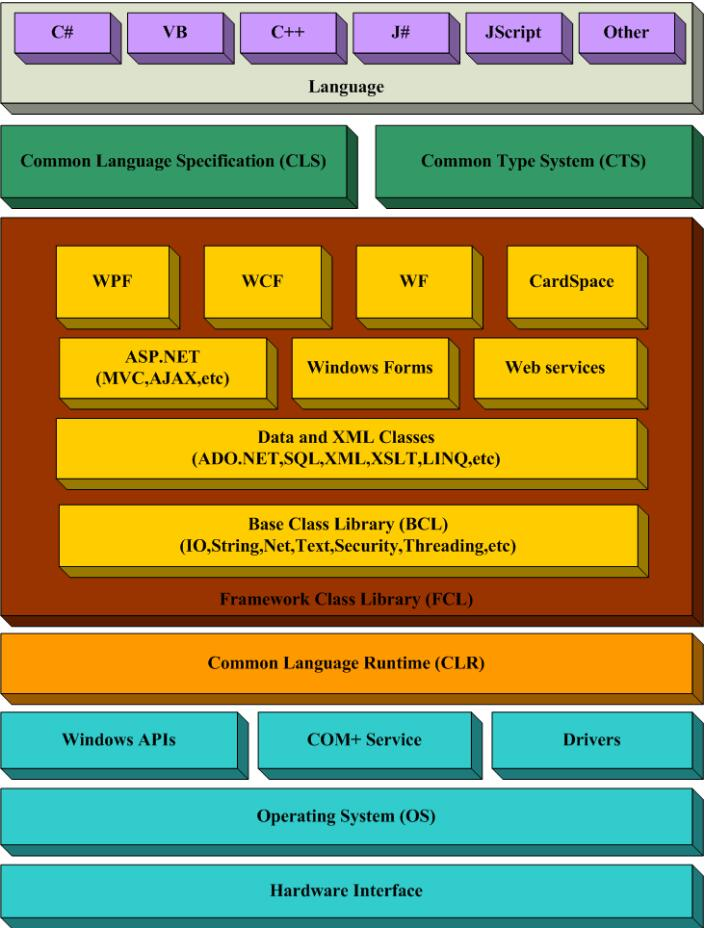
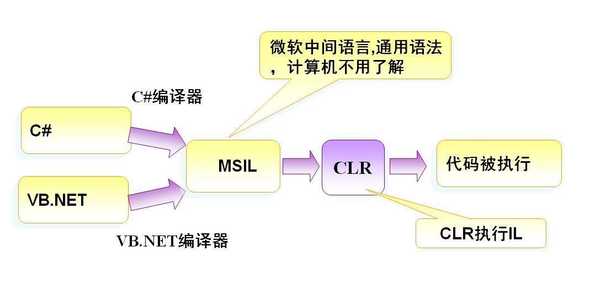

# **第一章  .NET与开发工具介绍**

## **.NET的由来**？
这是一个商业故事，事情还得从80年代说起...当时个人电脑PC兴起，微软（[Microsoft], [DOS系统]）与因特尔（[Intel], 芯片制造商）组成的Wintel联盟所向披靡，它们踩在蓝色巨人[IBM]（PC机,大型机制造商,Fortran）的肩上发达起来......关于更早计算机应用的故事，请看电影[《隐藏人物》]。整个80到90年代，微软Windows操作系统一度控制着整个PC市场，获得巨大成功......
   **Windows 1.0** (1983)    
   **Windows 2.0** (1987)    
   **Windows 3.0** (1992)    
   **Windows NT** (1993)     
 
&emsp;&emsp;微软的发展，被另外一家以生产浏览器软件而闻名的网景公司(Netscape)抢占了先机，它先于微软推出浏览器软件...当时，[SUN]公司以生产UNIX服务器为主，这种服务器可以用于网站建设，所以它始终坚持"网络就是电脑"
(The Network Is the Computer)的信条。当时，SUN公司也尝试设计一种名为Java的程序语言，一开始准备将其用在家用电器市场，因为Java代码灵活小巧，可移植性强，并能够跨平台操作(只需要装一个JAVA虚拟环境JVM，不同平台安装不同版本的JVM，Java只负责将.java翻译成.class,jvm将.class翻译成机器码，这样JAVA程序就能够被各种机器识别)，不局限于某种操作系统。
    **Java**    
1995年，互联网大行其道，SUN立刻意识到这是一个机会！因为Java适合用于编写浏览器软件。由于SUN当时对开发软件产品尚缺乏信心，所以它免费将Java放在网上，任由人们使用，没有想到此举使Java获得极大的成功和好评。微软为了打败Netscape，跟SUN达成某项交易，SUN允许微软使用Java言来开发IE浏览器，当IE成功问世时，微软将IE捆绑进操作系统中，使得很多电脑用户不得不使用IE作为缺省的浏览器软件。网景受到强烈的冲激，1996年春，网景拥有87%的市场占有率，1998年就降到40%，最后它也不得不免费供用户使用，终于在1998年11月，网景被美国在线(AOL)收购。  
&emsp;&emsp;**那么原本是亲密战友的SUN与微软是如何翻脸无情？以至Java最后也被Windows无情地抛弃呢？**

&emsp;&emsp;1996年9月的某个星期日，微软资深的软件工程师提笔给比尔·盖茨写了一封信，在信中,他们非常恳切地提醒比尔·盖茨注意一个正在形成的威胁，这个威胁不是来自别人，正是其盟友SUN公司创建的一种编程语言--Java，这种语言允许编程者一次性编写程序代码、就可以在多个不同的操作系统上运行(如从IBM的大型机到Sun公司的Unix服务器，再到WindowsPC机都能运行，甚至在手机平台上也可以)；而不需要针对每个计算机硬件和操作系统配置的不同而改动程序代码，并且这种语言在网络上是安全的。在信中，他写到："必须意识到Java不仅仅是一种语言，如果它仅只是一种语言，对微软是不会造成威胁的。我们愿意并且能够容易地为它建立最佳的表现形式，事情可以圆满解决了。但是事实上，Java绝不仅仅是一种语言，它是COM的替代者。"--而COM恰恰是Windows基于的编程模型。" 
&emsp;&emsp;盖茨在收到这封信时，正是他准备"闭关清修"的前几天，原来比尔·盖茨每年都要抽出一点时间来考虑微软长期发展战略，人称"思考周计划"。盖茨显然被这封信吓坏了，他第二天就回信了："这可把我吓坏了。我不清楚微软的操作系统要为Java的客户应用程序代码提供什么样的东西，而这些东西将足够让它来取代我们的市场地位。了解这一点非常重要，是应该最优先考虑的事情。"(没想到，这封信成为几年后司法部针对微软的反托拉斯案的呈堂证供。)于是，Java成了Windows中不受欢迎的客人，微软开始对其进行清扫，SUN又岂是好惹的？一场针尖对麦芒的好戏就开场了...一直持续到现在... 
&emsp;&emsp;**首先出场的，便是微软于2000年6月推出的.NET计划...**

## Microsoft. NET 战略
- 由于Java的“**一次编程，到处使用**”特点，微软针对性的提出了.NET战略。
- .NET战略基于[NGWS](Next Generation Windows Services)下一代视窗服务。
- Microsoft预计, **.NET计划能将各种编程语言的程序员都统一到一个开发架构中来，使得他们的作品能运行在任何OS的任何浏览器上，并实现跨平台、跨语言开发。**
- Microsoft基于以上理念打造.NET：
    - .NET 是一个基于因特网和 WEB 的全新架构
    - .NET 是用于通用服务（Universal Services）的一种构架
    - .NET 可运行于任何平台上的任何浏览器中
    - .NET 基于最新的 web 标准
    - .NET 计划包含
        - Windows 操作系统
        - 一个新版本的 Office 
        - **一个为开发人员准备的统一开发架构 - [.NET Framework]**
    - 因此，.NET计划也可以理解为：微软公司为了维持其操作系统在市场中的垄断地位而采取的一个新措施。

## .NET遵循的因特网协议
- HTTP，因特网应用程序之间的通信协议
- XML，用于在因特网应用程序之间交换数据的格式
- SOAP，用于请求 Web Service 的标准格式
- UDDI，用于搜索和发现 Web Service 的标准

## .NET Framework
-  **.NET Framework体系**    
- .NET Framework是一个基于Web应用程序的基础架构，用于构建、开发以及运行Web Service和Web应用程序的**公共环境**。(类似于JDK=JVM+JRE)
- 包含一套明确的技术规范和**一系列支持产品**,如下
    1. **类库**（FCL, Framework Class Library）
        - **[ASP.NET]**支持所有.NET类库，用来承载基于.NET创建的Web应用程序
        - Web Service: 处理XML
        - Web Form: 基于HTML的应用程序
        - Windows Form: 丰富的Windows GUI应用
        - Windows Console Application: 命令行程序
        - Windows Service: Windows服务应用程序
        - 组件库: 构建单独的程序集(组件)
    2.  **公共语言运行时**(Common Language Runtime, CLR), 负责应用程序实际的执行，满足所有的应用程序的需求，
        - 那么，CRL是如何实现语言无关性的呢？
        - 由于它内置了一个中间语言库(.NET通用语言,MSIL)，首先将众多程序语言翻译成中间语言，然后通过CLR编译成及其语言：
           **How CRL works**   

## .NET Framework发展历程
- .NET Framework由最先开始的2.0版（类库中只包含ASP.NET,ADO.NET与WinForms）逐渐发展成到融合众多扩展包在内的4.5版本
   **.NET Framework发展历程**   
- 直到今天的开源时代，Microsoft在2014年11月12日开放了.NET Framework的源码，并推出了[.NET Core]。
- .NET Core是一个模块化的开发栈，是参考.NET Framework重新开发的.NET实现，它是未来的所有.NET平台的基础。
- 同时，.NET Core将.NET 扩展为可在 Linux 和 Mac OS 平台上运行。
- .NET [Core时将基于MIT开源许可协议发布]，其中将包括执行.NET代码所需的一切项目— - - CLR、JIT编译器、垃圾收集器（GC）和核心.NET基础类库。
- 同时，微软还发布了Visual Studio 2013.NET（开源），使得VS在Linux和OS X系统上也能够运行了
- 这样，开发者们将能够在全球三个最大的操作系统上使用.NET Framework了...
   **.NET Core与. NET Framework的关系**   
- 因此.NET Core可看成是.NET Framework实现真正跨平台开发的利器。基于它，微软退出了.ASP.NET Core, Xamarin等等，组成了Core生态...
        

##.NET可以用来做什么
- 

## C#
- 由上可知，.NET 框架支持多种语言，C#,VB,J#,C/C++
- 与Java比较像(本来嘛，就是竞争产品)
- 

## ASP.NET Core
- 与
### IDEs
 **Visual Studio IDE家族演变**   
- **Visual Studio 2017** [download](https://www.visualstudio.com/zh-hans/)
    - Community版
    - Professional版
    - Enterprise版
- **Visual Studio Code** [download](https://code.visualstudio.com/)
    - **轻量级编辑器，微软良心产品，推荐结合.NET Core使用**:purple_heart:
    - [VS Code 使用手册]
    - [VS Code on Git]

## 查阅最新.NET Framework官方文档
- [中文.NETFramework链接]
- [英文.NETFramework链接]
 - [所有产品目录]

## 用VS Code + .NET Core运行第一个C#程序

<!-- 下面是本文档中用到的链接 --->
[《隐藏人物》]: https://baike.baidu.com/item/%E9%9A%90%E8%97%8F%E4%BA%BA%E7%89%A9/2454257?fr=aladdin
[DOS系统]:http://www.pc811.com/xitong/26367.html
[Microsoft]:https://www.microsoft.com/
[Intel]:https://www.intel.com/
[IBM]:https://www.ibm.com/
[微软与Netscape之间的恩怨]: https://en.wikipedia.org/wiki/Netscape
[SUN]:https://www.oracle.com/sun/index.html
[NGWS]:https://docs.microsoft.com/en-us/dotnet/framework/
[.NET Framework]:https://docs.microsoft.com/en-us/dotnet/framework/
[中文.NETFramework链接]:https://docs.microsoft.com/zh-cn/dotnet/framework/
[英文.NETFramework链接]:https://docs.microsoft.com/en-us/dotnet/framework/
[ASP.NET]:https://docs.microsoft.com/zh-cn/aspnet/core/
[Visual Studio]:https://www.visualstudio.com/zh-hans/
[Visual Studio Code]:https://www.visualstudio.com/zh-hans/
[.NET Core]: https://docs.microsoft.com/zh-cn/dotnet/core/
[.NET Core document]:https://docs.microsoft.com/zh-cn/dotnet/core/
[所有产品目录]: https://docs.microsoft.com/zh-cn/dotnet/
[VS Code on Git]:https://github.com/Microsoft/vscode/
[Core时将基于MIT开源许可协议发布]:https://github.com/dotnet/coreclr
[VS Code 使用手册]:https://code.visualstudio.com/docs

